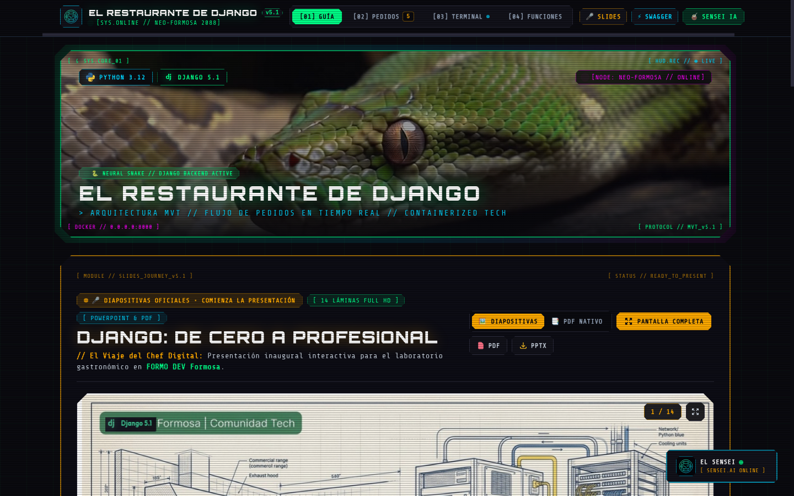
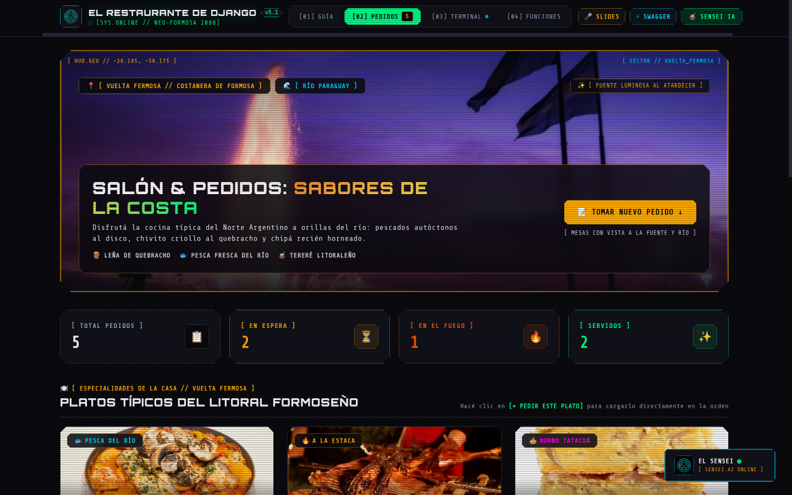
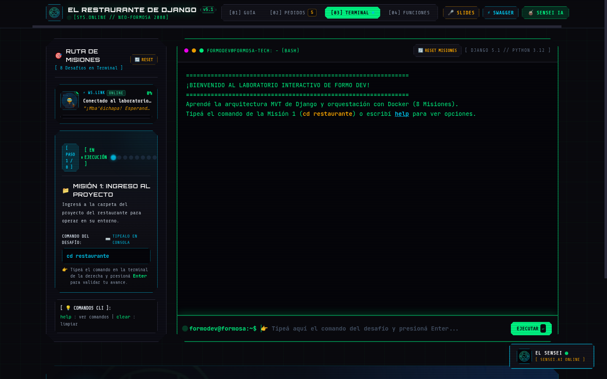
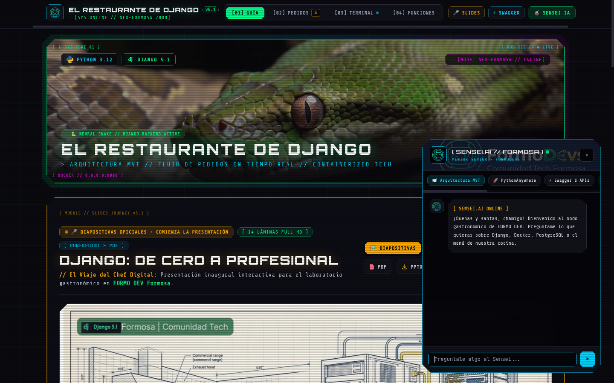
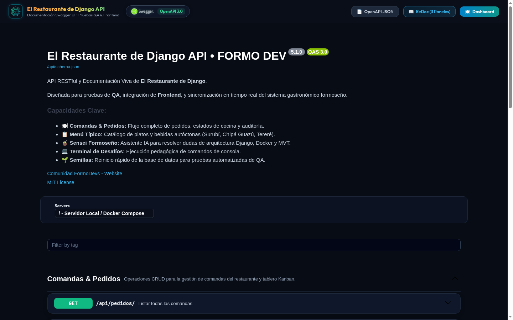
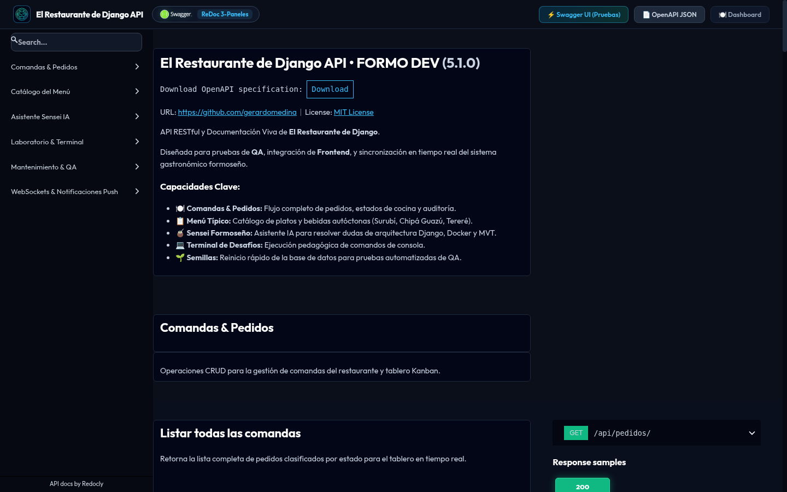

# 🍽️ El Restaurante de Django (Laboratorio Interactivo FORMO DEV)

[](https://germedi.pythonanywhere.com/)
[](https://www.djangoproject.com/)
[](https://www.python.org/)
[](https://www.docker.com/)
[](https://www.postgresql.org/)
[](https://germedi.pythonanywhere.com/swagger/)
[](#)

> 🌐 **Plataforma Desplegada en Producción (PythonAnywhere):**  
> 🔗 **Web Oficial:** [https://germedi.pythonanywhere.com/](https://germedi.pythonanywhere.com/)  
> 📑 **Documentación Swagger UI:** [https://germedi.pythonanywhere.com/swagger/](https://germedi.pythonanywhere.com/swagger/)  
> 📜 **Manual Técnico ReDoc:** [https://germedi.pythonanywhere.com/redoc/](https://germedi.pythonanywhere.com/redoc/)  
> 🤖 **Endpoint API REST del Sensei:** `POST https://germedi.pythonanywhere.com/api/chatbot/`

Bienvenido a **"El Restaurante de Django"**, una plataforma web educativa interactiva desarrollada para la comunidad de **FORMO DEV** (Formosa, Argentina). Este laboratorio enseña de forma visual y práctica la arquitectura **MVT** (Model - View - Template), la ingeniería en **Tres Capas**, y las mejores prácticas de **desarrollo modular con Docker, WebSockets y PostgreSQL**.

---

## 📸 Galería Visual del Laboratorio (Neo-Formosa 2088)

### 1. Dashboard Principal & Presentación Oficial
*Banner interactivo Cyber-Snake HUD con telemetría en vivo, reproductor de diapositivas oficiales (14 láminas Full HD) y visor de arquitectura MVT.*



---

### 2. Salón Costanero & Tablero Kanban en Tiempo Real
*Gastronomía autóctona de Formosa (Chupín de pescado de río, Chivito criollo a la estaca, Sopa paraguaya) con vista panorámica a la Costanera Vuelta Fermosa y pedidos reactivos.*



---

### 3. Terminal Bash Interactiva & Ruta de 8 Misiones
*Simulador de consola interactivo con progresión de misiones guiadas, indicadores LED y retroalimentación pedagógica paso a paso.*



---

### 4. El Sensei IA Formoseño (Mentor Híbrido < 1 ms)
*Asistente virtual de ingeniería con tonada urbana formoseña, atajos temáticos, latencia ultra-baja y guardrails estrictos de contexto.*



---

### 5. Documentación Interactiva OpenAPI 3.0 (Swagger UI & ReDoc)
*Contrato vivo entre backend y frontend con capacidad de probar endpoints en tiempo real sin salir del navegador.*

| Swagger UI Interactivo (`/swagger/`) | Manual Técnico ReDoc (`/redoc/`) |
|---|---|
|  |  |

---

## 🌟 1. La Analogía del Restaurante & MVT

Para comprender el flujo de Django, utilizamos la analogía gastronómica de Little Lemon:

```text
  [Comensal en la Mesa]
          │  (Petición HTTP a una URL: /tomar-pedido/)
          ▼
   📋 La Carta / Router (config/urls.py & restaurante/urls.py)
          │  (Enruta el pedido al cocinero adecuado)
          ▼
   👨‍🍳 El Cocinero (restaurante/views/ - Capa de Aplicación)
          │  (Consulta insumos vía ORM y aplica la lógica culinaria)
          ▼
   📦 La Despensa (restaurante/models.py & PostgreSQL - Capa de Datos)
          │  (Devuelve los ingredientes / datos consultados)
          ▼
   🤵 El Mozo & El Plato Listo (restaurante/templates/ - Capa de Presentación)
          │  (Renderiza el HTML con Tailwind CSS de vuelta al comensal)
          ▼
  [Comensal Servido - HTTP 200 OK]
```

### Correspondencia Arquitectónica de Tres Capas

| Capa | Rol en el Restaurante | Archivos Django | Tecnologías |
|---|---|---|---|
| **1. Presentación** | El Mozo, la Mesa y el Menú | `templates/dashboard.html`, `urls.py` | HTML5, Tailwind CSS, Vanilla JS |
| **2. Aplicación (Lógica)** | El Cocinero | `views/`, `chatbot_service.py` | Python 3.12, Django Views |
| **3. Datos (Persistencia)** | La Despensa e Insumos | `models.py`, `migrations/` | Django ORM, PostgreSQL / SQLite |

---

## 🚀 2. Opciones de Ejecución

### Opción A: Con Docker y Docker Compose (Recomendada)
La forma profesional y reproducible. Levanta en un solo comando el contenedor de la aplicación `web` y la base de datos `PostgreSQL 15` con volumen persistente.

```bash
# 1. Clonar o ingresar al proyecto
git clone https://github.com/Gerardomedinav/django_charla.git
cd django_charla

# 2. Levantar los contenedores en segundo plano
docker compose up -d

# 3. Cargar datos iniciales del menú formoseño
docker compose exec web python manage.py seed_data

# 4. Abrir en tu navegador
# http://localhost:8000
```

Para detener los contenedores:
```bash
docker compose down
```

---

### Opción B: Ejecución Local en Host con Python Virtualenv
Si deseas correrlo directamente en tu máquina con el entorno virtual creado:

```bash
# 1. Crear y activar el entorno virtual
python3 -m venv .venv
source .venv/bin/activate    # En Linux / macOS
# .venv\Scripts\activate     # En Windows PowerShell

# 2. Instalar dependencias
pip install -r requirements.txt

# 3. Aplicar migraciones
python manage.py makemigrations
python manage.py migrate

# 4. Cargar el menú gastronómico formoseño
python manage.py seed_data

# 5. Iniciar el servidor con Daphne (soporte WebSockets)
daphne -b 0.0.0.0 -p 8000 config.asgi:application
# O alternativamente con el servidor clásico:
# python manage.py runserver 0.0.0.0:8000
```

---

## 🎮 3. Ruta de Misiones en la Terminal (8 Desafíos Guiados)

La aplicación incluye un simulador de terminal interactivo en la pestaña **Terminal** para que los alumnos practiquen los comandos esenciales de backend y DevOps:

1. **Misión 1**: `cd restaurante` (Ingreso al directorio de trabajo del restaurante).
2. **Misión 2**: `ls` (Inspección de archivos y módulos MVT: `manage.py`, `Dockerfile`, apps).
3. **Misión 3**: `python manage.py makemigrations` (Generación del plano arquitectónico en Python).
4. **Misión 4**: `python manage.py migrate` (Construcción de tablas relacionales en PostgreSQL).
5. **Misión 5**: `python manage.py createsuperuser` (Creación del Chef Ejecutivo para `/admin/`).
6. **Misión 6**: `docker compose up -d` (Orquestación de contenedores web y db en segundo plano).
7. **Misión 7**: `docker ps` (Control de salud `healthy`, uptime y puertos mapeados).
8. **Misión 8**: `python manage.py seed_data` (Carga del menú autóctono y pedidos de demostración).

Comandos auxiliares de consola: `help`, `status`, `reset`, `clear`, `pwd`, `whoami`.

---

## 🧉 4. El Asistente Virtual: "El Sensei Formoseño"

En la esquina inferior derecha dispones del widget interactivo de **El Sensei**, un mentor técnico con calidez local (*"chamigo"*, *"pariente"*, *"con un buen tereré en mano"*, *"metele ficha"*) que responde al instante (< 1 ms) sobre:
- Arquitectura MVT y la analogía del restaurante.
- Despliegue en la nube con **PythonAnywhere** y Docker.
- Documentación interactiva de APIs con **Swagger UI** y ReDoc.
- Aislamiento de proyectos con entornos virtuales (`.venv`) y contenedores.
- Buenas prácticas de modularización (Proyecto vs Apps).
- Las 8 misiones interactivas de la terminal y cómo completarlas.
- **Guardrails (Regla 1)**: Si se le pregunta sobre recetas de pizza o temas ajenos, responde con sarcasmo formoseño amable y reencamina al alumno a los temas de la plataforma.

---

## 🛡️ 5. Los 3 Pilares de Seguridad en Producción

1. **`SECRET_KEY` en el `.env`**: Nunca se comparte ni se commitea en GitHub.
2. **`DEBUG = False` en producción**: Evita filtrar trazas de error, contraseñas o variables de entorno.
3. **`.env` en `.gitignore`**: Los secretos viven exclusivamente en la máquina del desarrollador o en el servidor de despliegue.

---

## 📂 6. Arquitectura Modular del Proyecto

```text
el_restaurante_de_django/
├── Dockerfile                  # Receta base Python 3.12 + libpq-dev
├── docker-compose.yml          # Orquestación de servicios web y PostgreSQL 15
├── requirements.txt            # Dependencias del proyecto
├── manage.py                   # CLI administrativo de Django
├── .env.example                # Plantilla de variables de entorno seguras
├── .gitignore                  # Exclusiones de Git (.env, db.sqlite3, .venv, etc.)
│
├── config/                     # El Proyecto (El Edificio Central)
│   ├── settings.py             # Configuración dual (Postgres en Docker / SQLite en Host)
│   ├── urls.py                 # Enrutador principal y Swagger/ReDoc
│   ├── wsgi.py                 # Pasarela WSGI (PythonAnywhere / Servidores tradicionales)
│   └── asgi.py                 # Pasarela ASGI para WebSockets con Daphne
│
├── core/                       # App Modular: Vistas Base & OpenAPI
│   ├── openapi.py              # Esquema OpenAPI 3.0 para Swagger y ReDoc
│   ├── views/dashboard_views.py# Dashboard principal y renderizado HUD
│   └── views/docs_views.py     # Endpoints interactivos de documentación
│
├── restaurante/                # App Modular: Lógica Gastronómica
│   ├── models.py               # Modelos Menu y Pedido (Capa de Datos)
│   ├── views/menu_views.py     # Catálogo del menú
│   ├── views/pedido_views.py   # Registro y avance de pedidos Kanban
│   └── management/commands/    # Comando de siembra inicial (seed_data.py)
│
├── laboratorio/                # App Modular: Simulador & Mentor IA
│   ├── services/mission_service.py # Lógica de progreso de las 8 misiones
│   ├── services/chatbot_service.py # Motor semántico del Sensei Formoseño
│   ├── views/terminal_views.py     # Consola interactiva Bash
│   └── views/chatbot_views.py      # API REST del Sensei (POST /api/chatbot/)
│
└── notificaciones/             # App Modular: WebSockets & Tiempo Real
    ├── consumers.py            # Consumidor asíncrono de Channels
    ├── routing.py              # Rutas WebSocket (ws/pedidos/, ws/terminal/)
    └── services.py             # Emisión de eventos para actualización de UI
```

---

**Comunidad FORMO DEV**  
*Impulsando el talento tecnológico desde Formosa para el mundo entero.* ☀️🇦🇷
